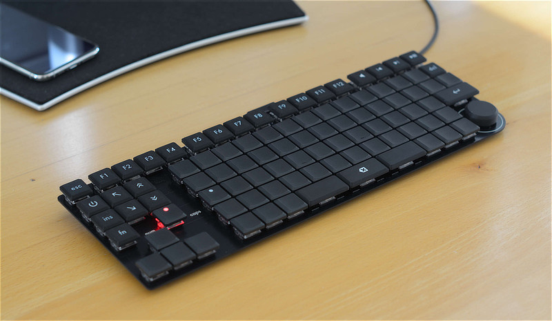

# DeskFighter

These are the files used to design and build the DeskFighter keyboard.

There is an article which describes the process:

https://haldimann.app/DeskFighter/

## Organization

### 3D Printed Parts

Files in step and 3mf format to 3D print keycaps and other small parts required for the keyboard build.

### FreeCAD

FreeCAD files used to export the 3D printed parts above. If you want to make modifications, this is the most convenient option.

https://www.freecad.org/

### Keycaps Labels

Affinity and svg files used to design the labels. These were imported into FreeCAD.

### Matrix Layout

Spreadsheet used to plan the keyboard matrix layout.

### PCB

KiCad project files used to design the printed circuit board (PCB). The actual manufacturing files (gerber and drill files) are not included, but can be exported from KiCad. Those are then sent to a PCB manufacturer which will make the board.

Also includes the MacroPad files - a test project to figure out some things with a small PCB before ordering the large DeskFighter PCB.

https://www.kicad.org/

## Additional parts required

The mentioned shops are just suggestions. All parts are available in other shops too.

| Shop                                         | Item                                                                                 | Quantity |
| -------------------------------------------- | ------------------------------------------------------------------------------------ | -------: |
| [Keebart](https://www.keebart.com/)          | Switches (Kailh Choc V2 with 2 pins)                                                 |      100 |
|                                              | THT keycaps blank                                                                    |       60 |
|                                              | THT keycaps with dot                                                                 |        2 |
|                                              | THT keycaps with tactile marker                                                      |        2 |
|                                              |                                                                                      |          |
| [Max Gaming](https://www.maxgaming.com/shop) | Durock V3 plate-mounted stabilizer set                                               |        1 |
|                                              |                                                                                      |          |
| [DigiKey](https://www.digikey.com/)          | [Various electronics components](https://www.digikey.com/en/mylists/list/9PG9QW3RYC) |        – |
|                                              |                                                                                      |          |
| [CNC Kitchen](https://cnckitchen.store/)     | M2 heat-set inserts                                                                  |       20 |
|                                              | Installation tip set (optional)                                                      |        1 |
|                                              |                                                                                      |          |
| [AliExpress](https://www.aliexpress.com/)    | M2 × 5 mm screws, black, Torx                                                        |       10 |
|                                              | Rubber feet, 8 mm × 3 mm, self-adhesived                                             |       20 |
